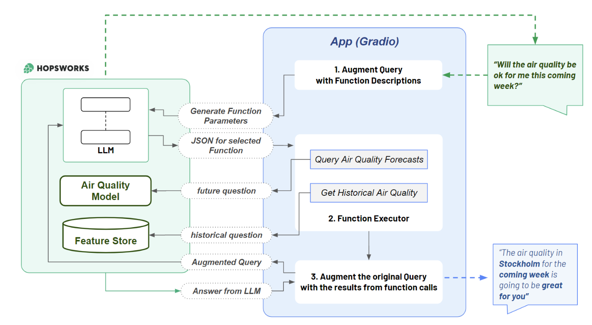

Here’s the updated **README.md** that includes the performance and plots for both versions of the model:

---

# AIR QUALITY PREDICTOR 🌍💨  

**Air Quality Predictor** is an advanced machine learning system designed to forecast air quality levels at *Serso via dei Caduti*, leveraging a feature store for integrated batch and real-time data pipelines. Inspired by O'Reilly's *Building Machine Learning Systems with a Feature Store: Batch, Real-Time, and LLMs*, this project demonstrates the power of scalable and interactive ML systems.

---

## 📌 Pipeline Overview  

The system is structured following the pipeline shown below.  
It integrates data collection, processing, management via a feature store, and prediction based on ML models.  

  
*Figure: Data flow and system architecture.*

---

## ✨ Key Features  

1. **Batch and Real-Time Processing:**  
   - Supports both **real-time** and **batch** predictions for flexible operations.  

2. **Advanced Feature Store:**  
   - Efficiently manages features for training and predictions.  

3. **Support for LLMs:**  
   - Implements advanced techniques like **Fine-Tuning** and **Retrieval-Augmented Generation (RAG)**.  

4. **Rolling Window Features:**  
   - Enhances predictive accuracy with a 3-day rolling mean of PM2.5 as an additional feature.  

5. **Interactive Predictions:**  
   - Live dashboard and tools for real-time data monitoring and prediction requests.  

---

## 🚀 Getting Started  

### 1. View Predictions  

#### With Rolling Window Features  
Access predictions that utilize rolling window features on the [Interactive Dashboard](https://jacopodallafior.github.io/Air_Quality_Rolling_Window/air-quality/).  

#### Without Rolling Window Features  
Explore predictions without rolling window features on this [Interactive Dashboard](https://jacopodallafior.github.io/Air_quality/air-quality/).  

### 2. Request a Prediction  
Submit a new prediction request using the [Gradio Live Tool](https://e8055f13e89e464989.gradio.live/).  

---

## Rolling Window Prediction Details  

This version implements air quality prediction using rolling window features to enhance the model's accuracy and prediction capabilities.  

### Rolling Window Feature Update  

1. **Rolling Window Calculation**  
   The dataset includes a new feature: a 3-day rolling mean of the PM2.5 values, calculated as follows:  
   ```python
   df_roll['pm25_3day_roll_mean'] = df_roll['pm25'].rolling(window=3).mean()
   ```

2. **Daily Feature Updates**  
   A notebook (**2_air_quality_feature_pipeline.ipynb**) recalculates the rolling window mean daily using real-time PM2.5 data.  

3. **Enhanced Predictions**  
   The rolling window feature, combined with weather data, provides accurate predictions for future PM2.5 levels.  

---

## ✨ Model Performance  

### Without Rolling Window Features  

- **MSE**: 34.85334  
- **R-Squared**: 0.01622  

  

### With Rolling Window Features  

- **MSE**: 6.9079943  
- **R-Squared**: 0.61780  

  

---

## ✨ Additional Resources  

- **Without Rolling Window Features:**  
   Predictions and pipeline details for the version without rolling window features can be accessed [here](https://jacopodallafior.github.io/Air_quality/air-quality/).  

- **With Rolling Window Features:**  
   Explore the enhanced rolling window feature pipeline [here](https://jacopodallafior.github.io/Air_Quality_Rolling_Window/air-quality/).  

---

## 🛠 How to Contribute  

We welcome contributions to improve this project:  
1. Fork the repository.  
2. Create a feature branch for your changes.  
3. Submit a pull request.  

Ideas for contribution:  
- Add support for more weather variables.  
- Enhance the dashboard UI.  
- Optimize prediction models.  

---

## 🤝 Acknowledgments  

This project was inspired by the book *Building Machine Learning Systems with a Feature Store: Batch, Real-Time, and LLMs* by O'Reilly. Special thanks to the [Hopsworks](https://www.hopsworks.ai/) team for their exceptional feature store platform.  

---

For questions or feedback, feel free to [open an issue](https://github.com/Grandediw/air-quality-prediction/issues).  

--- 
