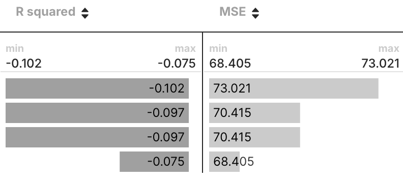
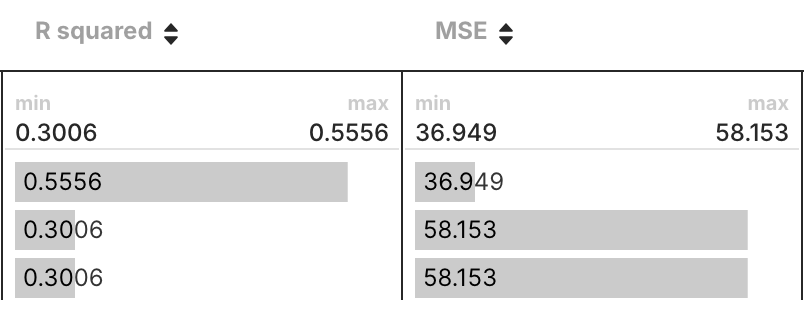

# ID2223 Lab1 - Air Quality Prediction Service for Helsinki, Kallio 2, Finland 
Group 25 - Mengmeng Yang， Zongrong Yang

## Lab Description
This project implements a complete machine learning pipeline for predicting air quality (PM2.5 levels) using weather data.

Here is the [dashboard](https://lemongooo.github.io/mlfs-book/air-quality/) shows 9-day predictions and the hindcast graph which compares daily predicted PM2.5 levels against actual data to evaluate the model's accuracy.
## Backfill Feature Pipeline
   - Use the  `1_air_quality_feature_backfill.ipynb` to develop a pipeline that downloads historical air quality data of Helsinki, Kallio 2, Finland from [AQICN](https://aqicn.org) and weather data from [Open-Meteo](https://open-meteo.com).
   - Register those data as two Feature Groups in Hopsworks to ensure data consistency and completeness for model training.

## Feature Pipeline
   - Employ `2_air_quality_feature_pipeline.ipynb` to set up a daily pipeline with GitHub Actions that fetches daily weather and air quality data and the upcoming 7-10 day weather forecast. 
   - Update new data in the Hopsworks Feature Groups to keep the model input current.

## Training Pipeline


## Batch Inference Pipeline


## Lagged Feature
To enhance the model for predicting air quality, lagged features of PM2.5 are used:
```python
df_aq['pm25'] = df_aq['pm25'].astype('float32')
df_aq['pm25_lag_1'] = df['pm25'].shift(1).astype('float32')
df_aq['pm25_lag_2'] = df['pm25'].shift(2).astype('float32')
df_aq['pm25_lag_3'] = df['pm25'].shift(3).astype('float32')
```
Air quality data typically shows time series correlations, meaning that today's air quality can influence the air quality in the following days. By including these lagged features, the model can capture such time dependencies and improve prediction accuracy.

| | Without Lagged Features | With Lagged Features |
|---|---|---|
| **Model Performance** | |  |