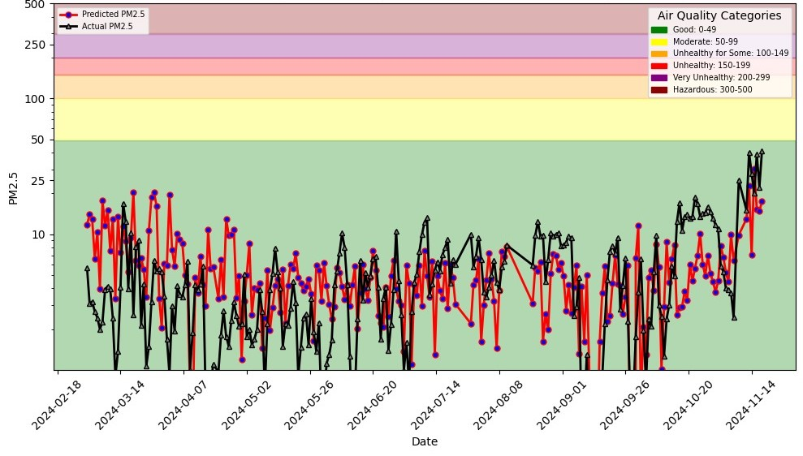
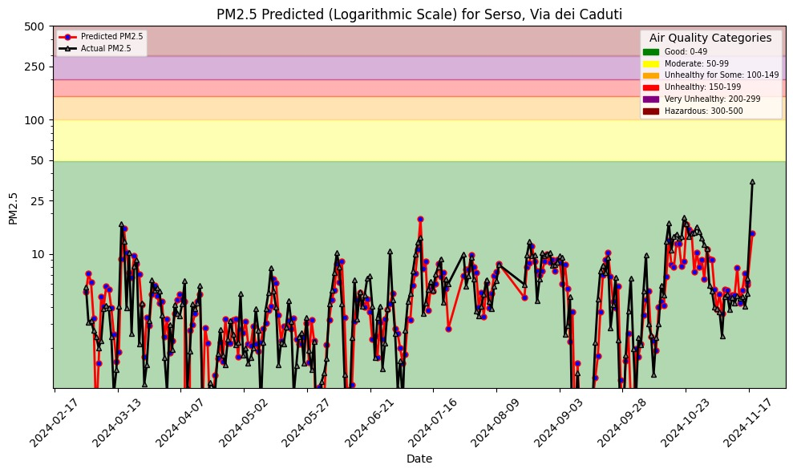

# AIR QUALITY PREDICTOR 🌍💨  

**Air Quality Predictor** is an advanced machine learning system designed to forecast air quality levels at *Serso via dei Caduti*, leveraging a feature store for integrated batch and real-time data pipelines. Inspired by O'Reilly's *Building Machine Learning Systems with a Feature Store: Batch, Real-Time, and LLMs*, this project demonstrates the power of scalable and interactive ML systems.

## Pipelines Overview

The system is designed as a series of modular pipelines, each addressing a specific stage of the data lifecycle: **Backfill**, **Daily Feature Updates**, **Model Training**, and **Batch Inference**. Below is a description of each pipeline.

---

### 1. Backfill Feature Pipeline
**File**: `1_air_quality_feature_backfill.ipynb`

This pipeline initializes the feature store by processing and ingesting historical data.

- **Purpose**: Populate Hopsworks with historical weather and air quality data.
- **Steps**:
  1. Load historical air quality data from [aqicn.org](https://aqicn.org) and weather data from [open-meteo.com](https://open-meteo.com).
  2. Engineer features such as PM2.5 levels, weather attributes (temperature, wind speed, etc.), and timestamps.
  3. Create feature groups in Hopsworks for both `air_quality` and `weather` datasets.
  4. Insert the processed historical data into the feature groups.

This pipeline is run once to initialize the dataset.

---

### 2. Daily Feature Pipeline
**File**: `2_air_quality_feature_pipeline.ipynb`

This pipeline ensures that the feature store remains up-to-date with the latest air quality and weather data.

- **Purpose**: Add daily updates to the feature store.
- **Steps**:
  1. Collect new air quality data and the weather forecast
  2. Update the `air_quality` and `weather` feature groups in Hopsworks with the new data.

This pipeline is scheduled to run daily using tools like GitHub Actions.

---

### 3. Training Pipeline
**File**: `3_air_quality_training_pipeline.ipynb`

The training pipeline automates the creation and evaluation of the predictive model.

- **Purpose**: Train a regression model to predict PM2.5 levels based on weather and historical air quality data.
- **Steps**:
  1. Create a feature view by joining the `air_quality` and `weather` feature groups.
  2. Split the feature view data into training and testing datasets.
  3. Train an XGBoost regression model on the training data.
  4. Evaluate the model using metrics (MSE and R-Squared)
  5. Save the trained model and upload it to Hopsworks for inference.


---

### 4. Batch Inference Pipeline
**File**: `4_air_quality_batch_inference.ipynb`

The batch inference pipeline generates predictions and monitors model performance.

- **Purpose**: Provide weekly predictions.
- **Steps**:
  1. Fetch recent data from the feature store.
  2. Use the trained model to predict air quality levels for the upcoming days.
  3. Compare predictions with actual observations (hindcast analysis).
  4. Generate visualizations, such as prediction graphs and hindcast plots.

This pipeline is scheduled to run daily alongside the feature pipeline.

---

## Deployment and Scheduling

1. **Hopsworks Integration**: All feature groups and models are managed via Hopsworks.
2. **Scheduling**: 
   - **GitHub Actions**: Daily runs for the feature and batch inference pipelines.
3. **Dashboard**: Visualize predictions using tools like Gradio.

---

## ✨ Key Features  

1. **Batch and Real-Time Processing:**  
   - Supports both **real-time** and **batch** predictions for flexible operations.  

2. **Advanced Feature Store:**  
   - Efficiently manages features for training and predictions.
     
3. **Rolling Window Features:**  
   - Enhances predictive accuracy with a 3-day rolling mean of PM2.5 as an additional feature.  

4. **Interactive Predictions:**  
   - Live dashboard and tools for real-time data monitoring and prediction requests.  

---

## 🚀 Getting Started  

### Prerequisites
- Python environment (Conda or virtualenv recommended)
- Accounts:
  - [Hopsworks](https://app.hopsworks.ai)
  - [GitHub](https://github.com) (and optionally [Modal](https://modal.com))
- Required Python packages (see `requirements.txt`)

---

## Rolling Window Prediction Details  

This version implements air quality prediction using rolling window features to enhance the model's accuracy and prediction capabilities.  

### Rolling Window Feature Update  

1. **Rolling Window Calculation**  
   The dataset includes a new feature: a 3-day rolling mean of the PM2.5 values, calculated as follows:  
   ```python
   df_roll['pm25_3day_roll_mean'] = df_roll['pm25'].rolling(window=3).mean()
   ```

2. **Daily Feature Updates**  
   A notebook (**2_air_quality_feature_pipeline.ipynb**) recalculates the rolling window mean daily using real-time PM2.5 data.  

3. **Enhanced Predictions**  
   The rolling window feature, combined with weather data, provides accurate predictions for future PM2.5 levels.  

---

## ✨ Model Performance  

### Without Rolling Window Features  

- **MSE**: 34.85334  
- **R-Squared**: 0.01622  

  

### With Rolling Window Features  

- **MSE**: 6.9079943  
- **R-Squared**: 0.61780  

  

---

## ✨ View Predictions  

- **Without Rolling Window Features:**  
   Predictions and pipeline details for the version without rolling window features can be accessed [here](https://jacopodallafior.github.io/Air_quality/air-quality/).  

- **With Rolling Window Features:**  
   Explore the enhanced rolling window feature pipeline [here](https://jacopodallafior.github.io/Air_Quality_Rolling_Window/air-quality/).  

---

## 🛠 How to Contribute  

We welcome contributions to improve this project:  
1. Fork the repository.  
2. Create a feature branch for your changes.  
3. Submit a pull request.  

Ideas for contribution:  
- Add support for more weather variables.  
- Enhance the dashboard UI.  
- Optimize prediction models.  

---

## 🤝 Acknowledgments  

This project was inspired by the book *Building Machine Learning Systems with a Feature Store: Batch, Real-Time, and LLMs* by O'Reilly. Special thanks to the [Hopsworks](https://www.hopsworks.ai/) team for their exceptional feature store platform.  

---

For questions or feedback, feel free to [open an issue](https://github.com/Grandediw/air-quality-prediction/issues).  

--- 
