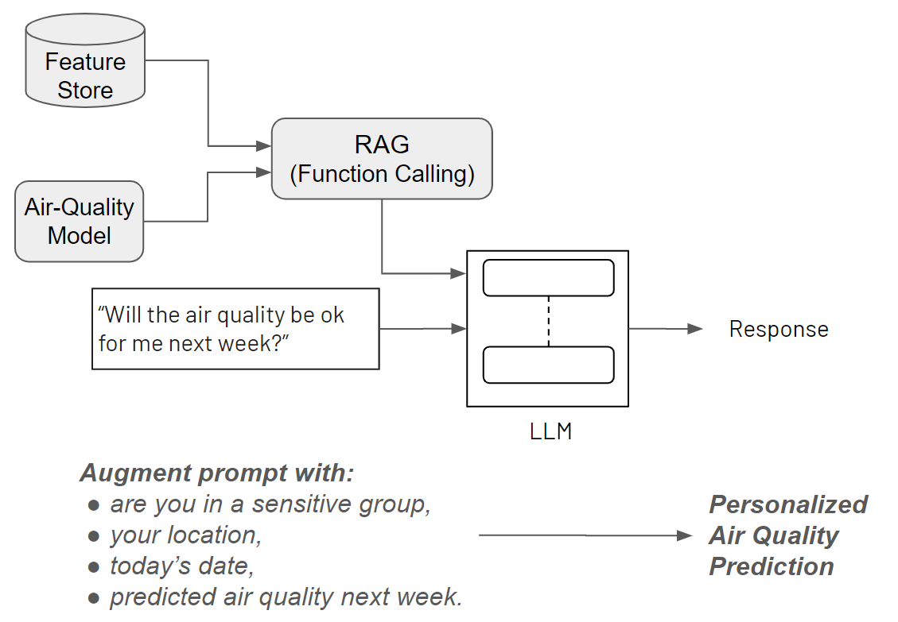
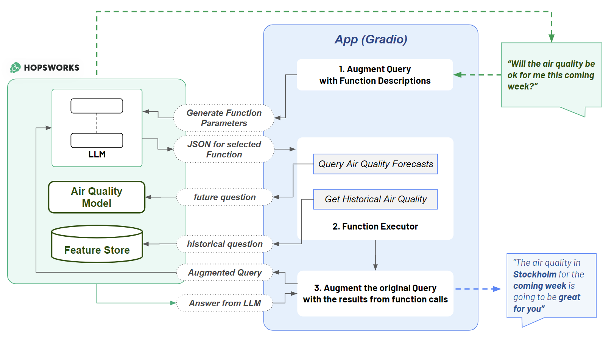

## Predict Air Quality

This project builds an Air Quality Forecasting Service for an Air Quality sensor available at https://waqi.info/.

The output is a forecast for air quality, like this one:

## Personalized Air Quality Predictions with a LLM

This air quality forecasting service has been augmented with LLM capabilities. You can ask it both future (forecasting) and historical questions about air quality at your location via a microphone or text input dialog.

## Application Architecture

## Tutorial Instructions

You can find [instructions for running this tutorial in this Google Doc](https://docs.google.com/document/d/1YXfM1_rpo1-jM-lYyb1HpbV9EJPN6i1u6h2rhdPduNE/edit?usp=sharing).
